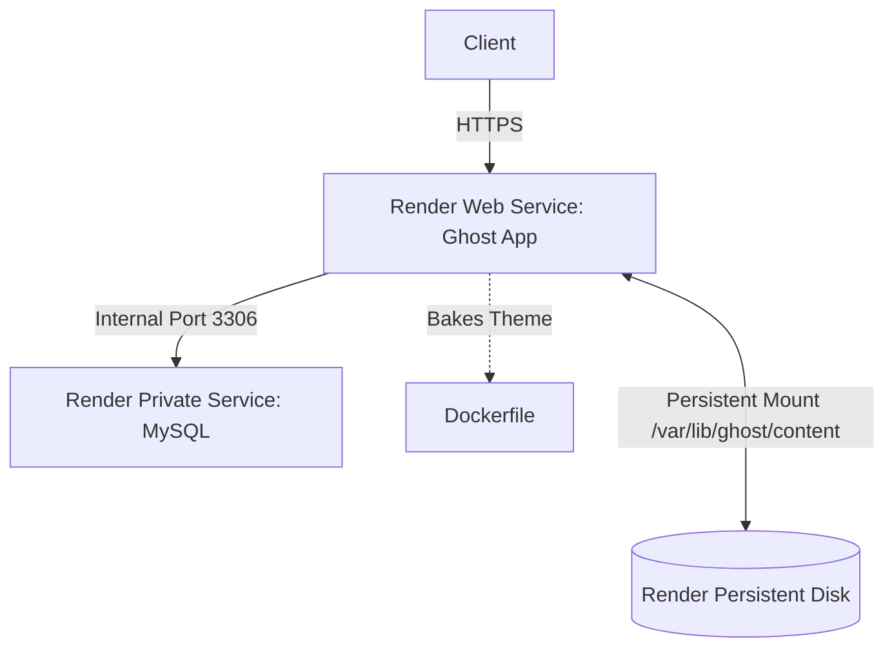
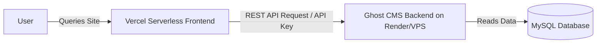

# Cloud Deployments (Render & Vercel) — Design Specification

**Date:** 2026-06-20
**Status:** Approved
**Stack:** Ghost CMS · Render (Blueprint) · MySQL 8.0 · Vercel (Next.js Headless Frontend)

---

## 1. Project Overview

This specification details the design for expanding deployment options to include modern cloud providers: **Render** (as a containerized Web Service + private MySQL database with disk persistence) and **Vercel** (hosting a headless Next.js frontend connected to our self-hosted Ghost backend).

### Goals

- Enable 1-click Infrastructure-as-Code deployment on Render using a `render.yaml` Blueprint file.
- Provide a `Dockerfile` that packages the custom `nightfall` theme directly into the Ghost image, ensuring compatibility with persistent volumes on cloud systems.
- Outline and document the step-by-step architecture and integration details for hosting a headless Next.js frontend on Vercel pulling from our Ghost instance.
- Preserve all existing deployment guides (Local Development and VPS) inside `README.md`.

---

## 2. Cloud Architecture

### Render Blueprint Architecture
Render will deploy a Private Service for MySQL and a Web Service running our custom Ghost image.



### Vercel Headless CMS Architecture
Vercel hosts the serverless Next.js frontend. The frontend queries the content from our Render-hosted Ghost CMS using the Ghost Content API.



---

## 3. Detailed Specifications

### 3.1 Custom Theme Dockerfile (`Dockerfile`)
To ensure the custom theme is available when Render mounts an empty persistent disk, we write the theme to both the template folder (`content.orig`) and the main folder (`content`). The container entrypoint will automatically initialize the persistent disk with our custom theme.

Location: `Dockerfile`
```dockerfile
FROM ghost:5-alpine

# Copy the custom theme into the container's content and template directories
COPY --chown=node:node ./ghost/themes/nightfall /var/lib/ghost/content.orig/themes/nightfall
COPY --chown=node:node ./ghost/themes/nightfall /var/lib/ghost/content/themes/nightfall
```

### 3.2 Render Blueprint (`render.yaml`)
A blueprint file defining a secure, private MySQL database linked to a Ghost application service.

Location: `render.yaml`
```yaml
services:
  # MySQL Private Database Service
  - type: pserv
    name: ghost-db
    env: docker
    image: mysql:8.0
    plan: starter
    envVars:
      - key: MYSQL_ROOT_PASSWORD
        generateValue: true
      - key: MYSQL_DATABASE
        value: ghost
      - key: MYSQL_USER
        value: ghost
      - key: MYSQL_PASSWORD
        generateValue: true
    disk:
      name: mysql-data
      mountPath: /var/lib/mysql
      sizeGB: 10

  # Ghost Web Service
  - type: web
    name: ghost-app
    env: docker
    dockerfilePath: Dockerfile
    plan: starter
    healthCheckPath: /
    disk:
      name: ghost-content
      mountPath: /var/lib/ghost/content
      sizeGB: 10
    envVars:
      - key: url
        value: https://yourdomain.onrender.com # User replaces this with their live URL
      - key: database__client
        value: mysql
      - key: database__connection__host
        value: ghost-db
      - key: database__connection__port
        value: 3306
      - key: database__connection__database
        value: ghost
      - key: database__connection__user
        value: ghost
      - key: database__connection__password
        fromService:
          type: pserv
          name: ghost-db
          envVar: MYSQL_PASSWORD
      - key: NODE_ENV
        value: production
```

### 3.3 README.md Additions
We will add two new sections under `## 🚀 Quick Start` in `README.md`:
1.  **Path C: Render Cloud Deployment (1-Click Blueprint)**
    - Instructions on connecting GitHub, creating a Blueprint Instance, and configuring `url` env variables.
2.  **Path D: Headless Vercel Deployment (Jamstack)**
    - Details on configuring an integration in Ghost Admin, obtaining a Content API Key, deploying a Next.js template to Vercel, and setting up environment variables (`GHOST_API_URL`, `GHOST_API_KEY`).

---

## 4. Verification Plan

| Test | Objective | Method |
|------|-----------|--------|
| **Dockerfile Verification** | Ensure custom Dockerfile builds and includes theme directories correctly. | Run `docker build -t ghost-custom .` and check files. |
| **Blueprint Validation** | Validate `render.yaml` syntax. | Verify fields match Render Blueprint specification. |
