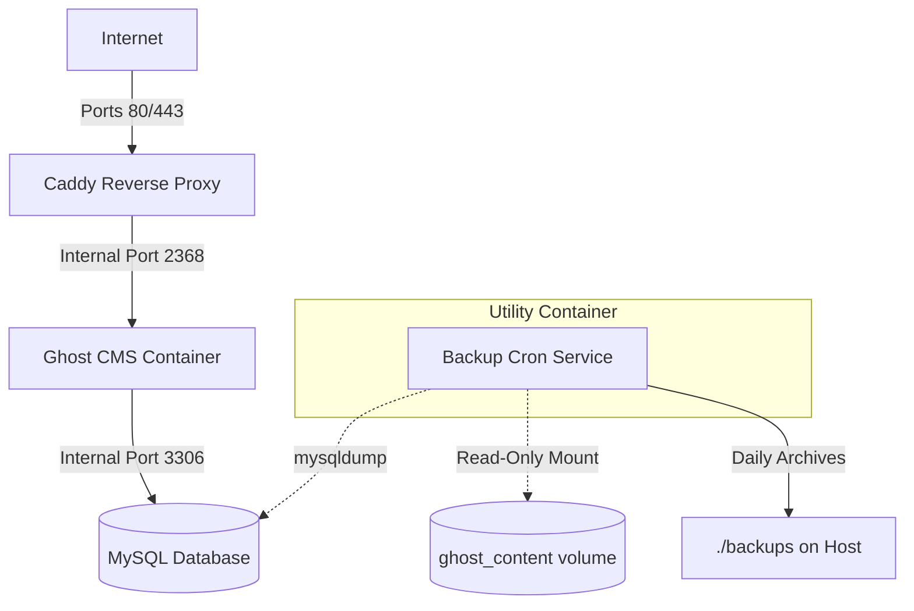

# Ghost Self-Hosted Production Hardening & Backup Automation — Design Specification

**Date:** 2026-06-20
**Status:** Approved
**Stack:** Ghost CMS · Caddy · MySQL 8.0 · Alpine (Backup Cron) · Docker Compose

---

## 1. Project Overview

This specification details the transition of the existing Docker Compose development stack into a production-ready self-hosted environment. The hardened architecture focuses on data durability (automated daily backups), email deliverability (SMTP integration for transactional emails), secure configuration (environment hardening), and automated host permission mapping.

### Goals

- Integrate SMTP configuration variables for newsletters, invites, and password resets.
- Introduce an automated, zero-config local backup container backing up both database dumps and the `ghost_content` directory.
- Create an automated `bin/setup.sh` script to manage `.env` creation, generate secure passwords, and establish correct file permissions.
- Harden Caddy security settings for production traffic.

### Non-Goals

- Migrating the stack to a cloud hosting platform (the target is generic self-hosting via Docker Compose on any standard Linux VPS).
- Configuring external S3 image storage adapters.

---

## 2. Architecture & Services

The container network is updated to include a lightweight utility service, `backup`, running alongside Caddy, Ghost, and MySQL.

### Docker Compose Services

We configure the following services:

1.  **`caddy`**: Reverse proxies traffic, manages Let's Encrypt certificates, applies security headers, and enforces rate limits.
2.  **`ghost`**: Runs the main Ghost Node.js application, configured with production database and mail parameters.
3.  **`db`**: MySQL database service, accessible only inside the virtual bridge network.
4.  **`backup`**: Lightweight Alpine container containing `mariadb-client` and `tar` that executes daily database dumps and filesystem archiving, storing the results on the host with a 7-day retention period.

---

## 3. Detail Specifications

### 3.1 Docker Compose Environment (`docker-compose.yml`)

The `ghost` service environment variables will be expanded to support SMTP:
- `mail__transport`: `SMTP`
- `mail__from`: `${MAIL_FROM}`
- `mail__options__host`: `${MAIL_HOST}`
- `mail__options__port`: `${MAIL_PORT}`
- `mail__options__secure`: `${MAIL_SECURE}`
- `mail__options__auth__user`: `${MAIL_USER}`
- `mail__options__auth__pass`: `${MAIL_PASS}`

The new `backup` service:
- Image: `alpine:latest`
- Volumes:
  - `ghost_content:/backup/ghost_content:ro` (read-only)
  - `./backups:/backups`
- Cron command:
  1. Installs package dependencies: `apk add --no-cache mariadb-client tar`.
  2. Injects backup routine into `/etc/periodic/daily/backup`.
  3. Spawns `crond -f -l 2` in the foreground.

### 3.2 Environment Template (`.env.example`)

We will add variables for:
- Database secrets (`MYSQL_ROOT_PASSWORD`, `MYSQL_PASSWORD`)
- Site metadata (`SITE_URL`)
- Email credentials (`MAIL_FROM`, `MAIL_HOST`, `MAIL_PORT`, `MAIL_SECURE`, `MAIL_USER`, `MAIL_PASS`)

### 3.3 Setup Automation (`bin/setup.sh`)

A bash script to automate environment provisioning:
1.  Check for `.env`. If missing, copy `.env.example` to `.env`.
2.  Scan `.env` for placeholder passwords (`change_me_root_password_here`, `change_me_ghost_password_here`). If present, replace them with cryptographically secure 32-character random strings (generated using `openssl rand -hex 16` or `/dev/urandom`).
3.  Ensure host directories `./backups` and `./ghost/themes/nightfall` exist.
4.  Optionally instruct on permissions adjustment depending on host OS (UID 1000 mapping).

### 3.4 Caddy Configuration (`Caddyfile`)

Verify and adjust headers:
- Keep current HTTP headers (`X-Content-Type-Options`, `X-Frame-Options`, `Referrer-Policy`, etc.)
- Add `request_body_limit 20m` to proxy block (preventing excessively large asset uploads).

---

## 4. Verification Plan

| Test | Objective | Method |
|------|-----------|--------|
| **Syntax Validation** | Validate YAML syntax and configuration mapping. | Run `docker compose config`. |
| **Permissions Check** | Verify Ghost has write permission to `ghost_content` volume and read access to the mounted theme. | Start stack, verify theme is active without warning in `/var/lib/ghost/content/themes`. |
| **Email Transport** | Verify Ghost successfully passes SMTP tests. | Perform "Test email send" inside Ghost Admin interface. |
| **Backup Execution** | Trigger backup script manually and verify file creation. | Run `docker compose exec backup sh -c "/etc/periodic/daily/backup"` and check `./backups` for valid `.sql.gz` and `.tar.gz` files. |
